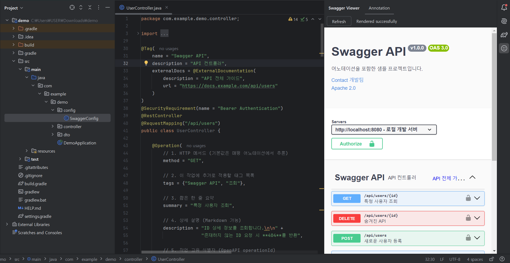

# Swagger Viewer — IntelliJ Plugin

🌐 **English** 
| [한국어](https://github.com/delight-HK3/swagger-viewer/blob/main/docs/README.ko.md) 



**Preview your Swagger/OpenAPI documentation instantly inside JetBrains IDEA — no build, no save, no server required.**

See your Swagger annotations reflected live in the Tool Window as you type.
Works identically on both IntelliJ IDEA Community and Ultimate.

---

## Key Features

### Real-Time Annotation Preview
- Parses Swagger annotations in `@RestController` / `@Controller` classes via PSI static analysis
- Supports `@Operation`, `@ApiResponse`, `@Parameter`, `@OpenAPIDefinition`, `@SecurityScheme`, and more
- Tool Window preview updates **as you type** — no save, no build, no app launch needed
- Targets Java / Kotlin projects based on Spring Boot or Spring MVC

### YAML / JSON Spec File Preview
- Auto-detects OpenAPI spec files (`.yaml`, `.yml`, `.json`) containing `openapi: 3.x` or `swagger: 2.0`
- Preview updates in real time while editing (300ms debounce)
- Does not interfere with regular YAML / JSON files

### IDE Integration
- **Swagger Viewer** Tool Window appears automatically on the right side of the IDE — no separate browser needed
- Annotation tab and YAML tab are configured automatically (tabs with no relevant files are hidden)
- Full feature parity between IntelliJ IDEA **Community and Ultimate**

---

## How It Works

```
Typing (DocumentListener)
    └─ 200ms debounce (Coroutine)
        └─ ReadAction (background thread)
            └─ PSI static analysis → Swagger model → YAML serialization
                └─ EDT: render in JCEF (embedded Chromium)
```

- **No network required**: `swagger-ui-dist` static assets are bundled in the plugin and loaded via `file://`
- **No EDT blocking**: PSI parsing runs in a background `ReadAction`; only the result is handed to the EDT
- **No Ultimate-only APIs**: all features work on Community builds

---

## Requirements

- IntelliJ IDEA **2024.2** or later (Community or Ultimate)
- Annotation preview requires a Spring Boot / Spring MVC based project

---

## Build & Development

```bash
./gradlew buildPlugin           # Build plugin zip
./gradlew test                  # Run unit tests
./gradlew verifyPlugin          # Plugin Verifier — checks for internal API usage and binary compatibility
./gradlew verifyPluginStructure # Validate plugin.xml structure
./gradlew runIde                # Launch sandbox IDE for manual UI testing
```

---

## Contributing

Contributions are welcome! Please read [CONTRIBUTING.md](CONTRIBUTING.md) before submitting a PR.

---

## Project Structure

```
src/main/kotlin/com/github/swaggerViewer/
├── view/
│   ├── SwaggerViewerToolWindowFactory.kt  # Tool Window registration and lifecycle
│   ├── SwaggerViewerPanel.kt              # Annotation preview tab (JCEF)
│   ├── SwaggerViewerYamlPanel.kt          # YAML/JSON preview tab (JCEF)
│   └── SwaggerPreviewHtmlBuilder.kt       # Swagger UI HTML builder
├── service/
│   ├── annotation/
│   │   ├── SwaggerPreviewPipeline.kt      # Pipeline entry point (debounce & coordination)
│   │   ├── SwaggerAnnotationScanner.kt    # PSI traversal → annotation collection
│   │   ├── SwaggerAnnotationSerializer.kt # Internal model → OpenAPI YAML serialization
│   │   ├── PsiSchemaAnalyzer.kt           # PSI types → Schema conversion
│   │   ├── AnnotationValueReader.kt       # Annotation attribute value extraction utilities
│   │   └── parser/                        # Per-annotation parsers (Operation, Parameter, Response…)
│   ├── yaml/
│   │   └── SwaggerSpecDetector.kt         # OpenAPI spec file detection
│   └── common/
│       └── SwaggerAssetsExtractor.kt      # swagger-ui-dist bundled asset extraction
└── model/                                 # Internal data models for Swagger annotations
```
